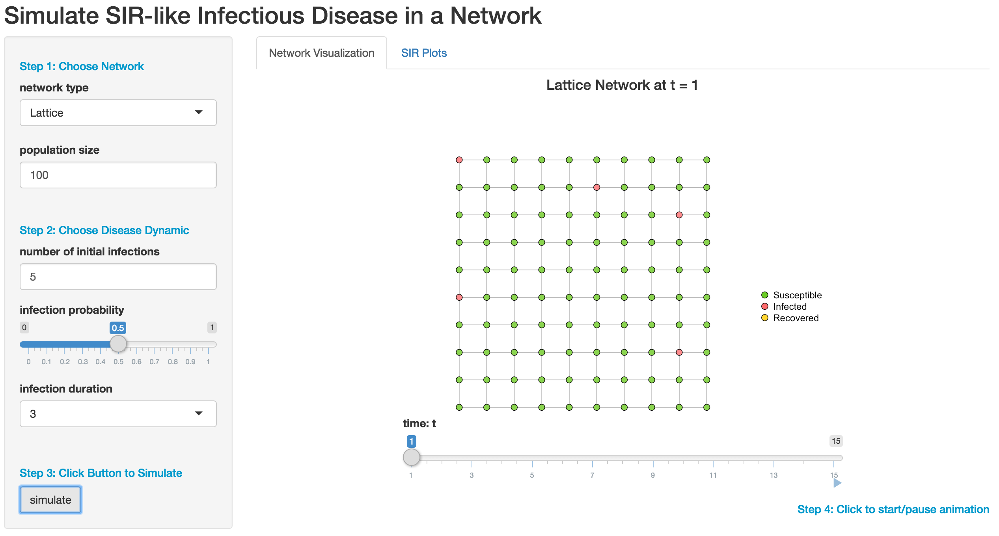

# A shiny app to simulate infectious disease in networks 

This Shiny app is for simulating and visualizing the spread of SIR-like infectious disease in networks. 

The app allows you to select different types of network structure and set the parameters to control the disease dynamic. The underlying algorithm uses an agent based model to simulate the disease progression. The app displays an animation of disease progression in the network, and summary plots of the S-I-R compartment size over time. 

## Usage
You will need RStudio and internet connection to run the app. Click [here](https://www.rstudio.com/home/) to install RStudio.

To launch the app, open RStudio and run the following code. 

```R
# install shiny package if not found
if(!"shiny" %in% installed.packages()){install.packages("shiny")}

library(shiny)
runGitHub("shiny-SimNetwork","alisonswu")
```
## Screenshots
Here are example screenshots of the app. 

<p align="center">
  
  
</p>


## Documentation
We use the [R igraph](http://igraph.org/r/) package to generate a graph representation of network. Each vertex of the graph represents an individual in the network, and the edge between two vertices represents physical contact between the individuals. 

<p align="center">
  
</p>

We use an agent-based model to simulate an SIR-like infectious disease over discrete time points .


The inividuals in the network can have one of the three statuses: susceptible (S), infected (I), recovered (R). <br />
At , <br />
- the network is initiated with a small subset of infected individuals, while the remaining individuals are susceptible. 


At , <br />
- a suscpetible individual becomes infected with probability , where  is probability of an infected individual passing infection to a susceptible individual through edge connection over 1 time period, and  is the number of infected neighbors with edge connection; <br />
- an infected individual becomes recovered after the infection duration;<br />
- a recovered individual remains recovered.  


